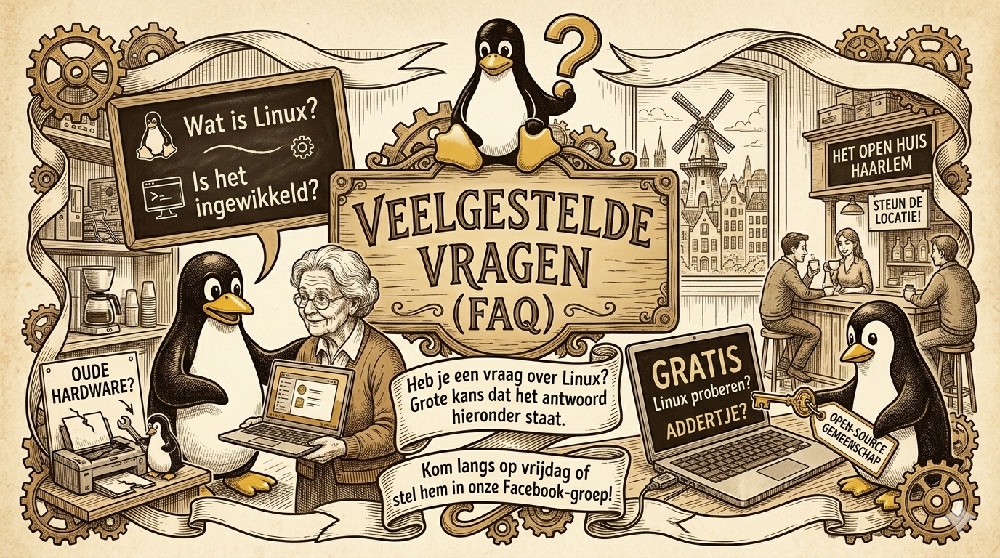

# Veelgestelde Vragen (FAQ) 🐧

Heb je een vraag over Linux, onze bijeenkomsten of je oude hardware? Grote kans dat het antwoord hieronder staat. Staat je vraag er niet bij? Kom dan gewoon langs op vrijdag of stel hem in onze Facebook-groep!

---

### 1. Wat is Linux eigenlijk?
Linux is een gratis en open-source besturingssysteem. Je kunt het zien als een alternatief voor Windows of macOS. Het grote verschil is dat Linux niet eigendom is van één bedrijf. Het wordt door duizenden vrijwilligers en bedrijven over de hele wereld gebouwd. Het is veilig, privacy-vriendelijk en vaak veel sneller op oudere computers.

### 2. Is Linux niet heel erg ingewikkeld?
Vroeger moest je veel typen in zwarte schermen (de terminal), maar dat is allang niet meer zo. Moderne versies van Linux zien er prachtig uit en werken bijna hetzelfde als Windows. Je hebt een startmenu, een taakbalk en een 'app store' waar je met één klik programma's installeert. Zoals we al zeiden: onze (schoon)moeders van 70+ gebruiken het ook!

### 3. Kan ik mijn vertrouwde programma's blijven gebruiken?
Voor bijna alles is een alternatief:
* **Internet:** Chrome, Firefox en Edge werken perfect.
* **Office:** Microsoft Office werkt online via de browser. Voor offline gebruik is er LibreOffice (gratis en opent al je Word- en Excel-bestanden).
* **E-mail:** Outlook (online) werkt prima, en programma's zoals Thunderbird zijn uitstekende alternatieven.
* **Foto/Video:** Er zijn geweldige gratis tools zoals GIMP (voor Photoshop-gebruikers) en Kdenlive en OBSstudio voor YouTubers.

### 4. Werkt mijn hardware wel met Linux?
Linux staat bekend om zijn geweldige ondersteuning voor hardware. Juist oude printers, scanners en wifi-kaarten die door Windows niet meer worden ondersteund, werken vaak 'out-of-the-box' op Linux. Neem je apparatuur gerust mee naar het café, dan testen we het samen.

### 5. Moet ik mijn hele computer wissen om Linux te proberen?
Nee hoor! We kunnen Linux op een USB-stick zetten. Je start je computer dan op vanaf die stick. Linux draait dan tijdelijk in het geheugen zonder je harde schijf aan te raken. Zo kun je alles rustig uitproberen.

### 6. Waarom is het gratis? Waar zit het addertje?
Er is geen addertje. De filosofie achter open-source is dat software een publiek goed moet zijn, net als de bibliotheek. Veel bedrijven (zoals Google en Tesla) gebruiken Linux en investeren erin, waardoor het voor de gewone gebruiker gratis blijft.

### 7. Moet ik een expert zijn om naar het Linux Café te komen?
Absoluut niet! De meeste mensen die bij ons komen zijn beginners. Het doel van het café is juist om elkaar te helpen. Of je nu komt met een concrete vraag of gewoon even wilt kijken wat Linux is: je bent welkom.

### 8. Moet ik me vooraf aanmelden?
Moet niet, maar het is wel handig omdat we kleinschalig willen blijven en iedereen persoonlijke aandacht willen geven (max. 4 personen per groepje), dus vragen we je om je aan te melden via [Telegram](https://t.me/+6RERHbiTNRk5MjQ0). Zo weten we zeker dat er een stoel en een expert voor je klaarstaan.

### 9. Helpen jullie ook met hardware-reparaties?
Als je laptop traag is door software, lossen we dat op met Linux. Is je scherm kapot of je toetsenbord defect? Dan kijken we samen met onze partners van het **Linux Repair Café** of **Laptop Revive** of we onderdelen kunnen vervangen. Gooi het in ieder geval niet weg!

### 10. Kost deelname echt helemaal niets?
De hulp en de software zijn 100% gratis. We zijn te gast bij Het Open Huis Haarlem, dus we waarderen het wel enorm als je een kop koffie of thee bestelt aan de bar om de locatie te steunen.
