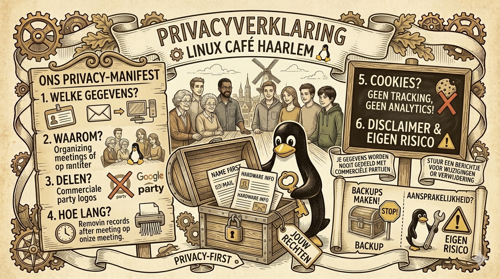

# Privacyverklaring Linux Café Haarlem 🐧

Bij Linux Café Haarlem draait alles om digitale vrijheid en privacy. Wij verzamelen zo min mogelijk gegevens en gaan daar uiterst zorgvuldig mee om. In deze verklaring leggen we uit wat we met je gegevens doen.

### 1. Welke gegevens verzamelen we?
Wanneer je het aanmeldformulier op onze website invult, vragen we om:
* **Je naam:** Zodat we weten wie we kunnen verwelkomen.
* **Je e-mailadres:** Om je aanmelding te bevestigen of contact op te nemen bij wijzigingen.
* **Informatie over je hardware:** Zodat onze vrijwilligers zich kunnen voorbereiden op je vraag.

### 2. Waarom verzamelen we deze gegevens?
We gebruiken deze gegevens uitsluitend voor de organisatie van de bijeenkomsten op vrijdag. We gebruiken je e-mailadres **niet** voor nieuwsbrieven of marketing, tenzij we daar in de toekomst expliciet om vragen.

### 3. Delen met derden
Wij verkopen, verhuren of delen je gegevens nooit met commerciële partijen. Je gegevens worden alleen ingezien door de coördinatoren van het Linux Café Haarlem.

### 4. Bewaartermijn
We bewaren je gegevens niet langer dan nodig is. Aanmeldingen voor specifieke vrijdagen worden na afloop van de bijeenkomst uit onze actieve lijst verwijderd, tenzij je hebt aangegeven vaker hulp nodig te hebben.

### 5. Cookies
Onze website is gebouwd met Grav en is 'privacy-first'. Wij gebruiken:
* **Geen** tracking-cookies.
* **Geen** analytische cookies van derden (zoals Google Analytics).
* **Geen** advertentie-netwerken.

### 6. Jouw rechten
Je hebt altijd het recht om te vragen welke gegevens we van je hebben, deze te laten wijzigen of volledig te laten verwijderen. Stuur hiervoor een berichtje via het contactformulier of spreek ons aan tijdens een bijeenkomst.

---

# Disclaimer & Eigen Risico ⚠️

Hoewel onze vrijwilligers zeer ervaren zijn en met grote zorgvuldigheid te werk gaan, is deelname aan het Linux Café op eigen risico:

* **Backups:** Je bent zelf verantwoordelijk voor het maken van een volledige backup van je documenten, foto's en andere bestanden voordat je langskomt voor een installatie of reparatie.
* **Aansprakelijkheid:** Linux Café Haarlem, de vrijwilligers en de locatie (Het Open Huis) zijn niet aansprakelijk voor eventueel dataverlies of schade aan hardware die ontstaat tijdens of na onze hulp.

**Door gebruik te maken van onze diensten, ga je akkoord met deze voorwaarden.**
